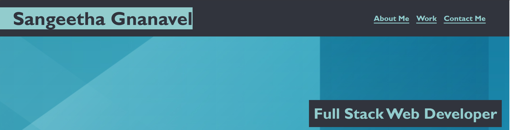
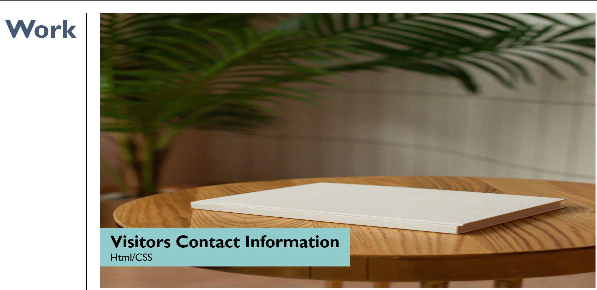
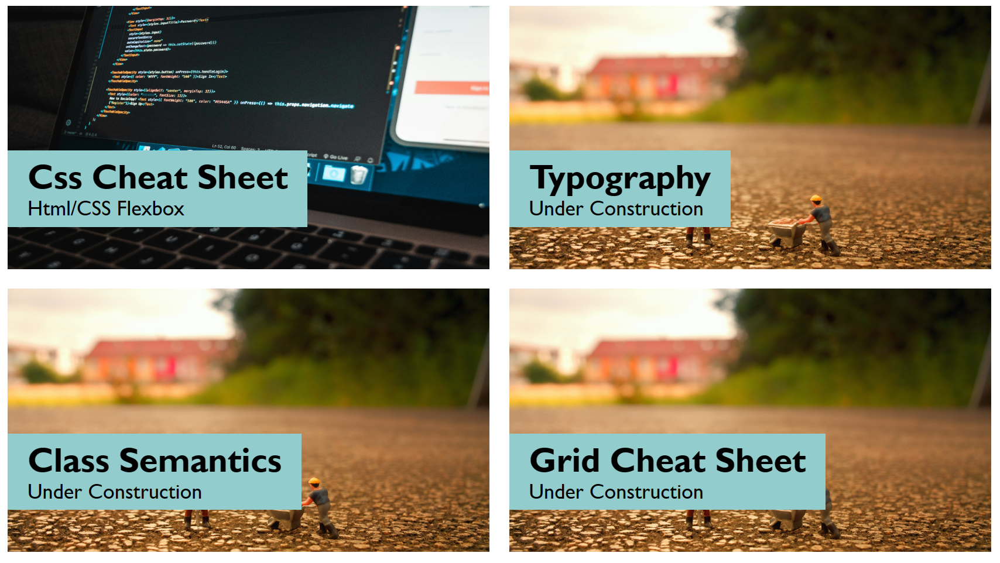

# My_Portfolio

# # Motivation

To develop my portfolio page to demonstrate the projects and my skills.

## Table of Contents

1. [About the Project](#about-the-project)
2. [Screenshots](#screenshots)
3. [URL](#url)
4. [Author](#author)

# About the Project

- The application is developed using Html and CSS.
- Have used various semantic Html elements like header, section, nav, article, footer etc to layout the page.
- Have used various CSS properties like flexbox, grid, media queries to enhance the web page and to make it responsive.
- Have used variables in css file to store repeated values.

# Screenshots

# Deployed URL

https://sangeethagnanavel.github.io/My_Portfolio/

# Author

Sangeetha Gnanavel a Full Stack Developer interested in continous learning.

**[Back to top](#table-of-contents)**
